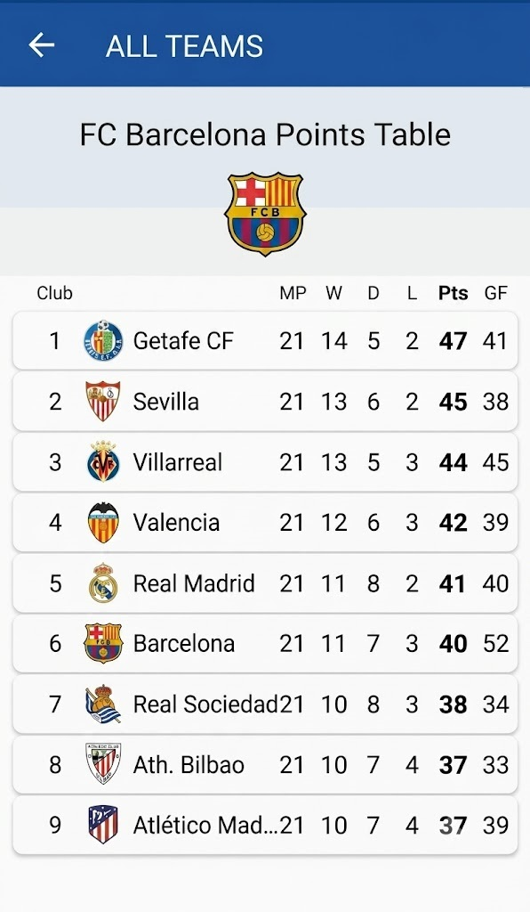

## Features & UI Components

### UI Layout Preview

  

The application implements a clean, highly legible sports standings matrix using standard Material Design guidelines.

### 1. Navigation & Headers
* **Toolbar (`TopAppBar`):** Utilizes an explicit up-navigation button paired with a global section title (`"ALL TEAMS"`).
* **Contextual Header:** A vertical stack dynamic template that updates based on user selection, loading the specific team's marquee name and high-resolution club crest asset.

### 2. Standings Matrix (`RecyclerView`)
* **Header Layer:** A fixed, lightweight non-scrollable layout enforcing explicit column weights for core football metrics (`MP`, `W`, `D`, `L`, `Pts`, `GF`).
* **ViewHolders (`CardView`):** Individual rows are wrapped in elevated, rounded card surfaces to ensure structural contrast against the canvas background.

### 3. Layout Optimization & Data Handling
* **Typography Hierarchy:** The critical sorting metric (`Pts`) is programmatically styled with a bold typeface (`FontWeight.Bold`) to optimize scannability.
* **Viewport Safeguards:** Long string data is protected against clipping and layout breakage on smaller screen widths using end-truncation (`ellipsize="end"`), visible on localized names like `"Atlético Mad..."`.
* **Asynchronous Asset Loading:** Team badges are rendered dynamically from cached network URLs, minimizing the local APK footprint.
